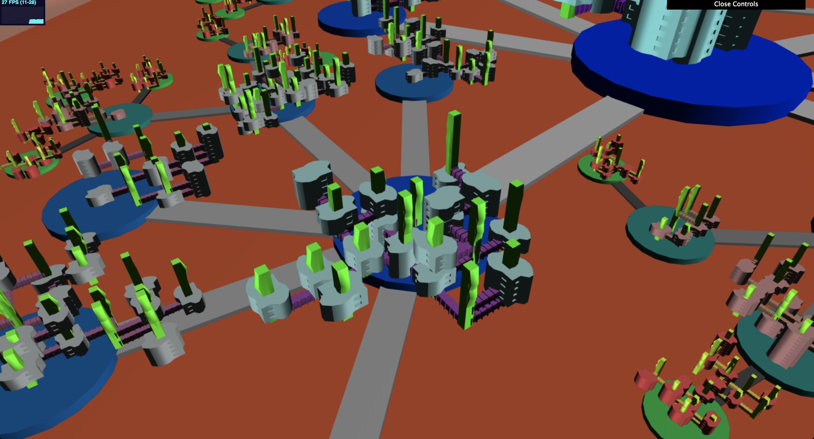

# Project 5: Shape Grammar

# Alien Mars Colony

The city structure that I decided to model was an alien colony on Mars.  Each colony has a glass dome surrounding it.  Inside, the center has a platform with increasingly smaller platforms connected outwards to the bounds of the crater the colony is housed inside.

## Demo Link

https://ishanranade.github.io/homework-5-shape-grammar-city-IshanRanade/

## Shape Grammar

There are a number of rules to the grammar that create the intricate internal structure:

The first set of rules are to divide up the colony into Unit sections, within which the buildings will be placed:

1) First place a single Unit node at the center of the colony.
2) If you encounter a Unit node, send out an x amount of test vectors in random directions (based on a noise funcction), to test the next possible location of a Unit.
3) If the next location is valid, e.g. does not intersect another Unit, then place the Unit.
4) Create a Road between these two Units.
5) Recursively continue this process for a max iteration number of times, reducing the radius of each Unit for each recursive call.
6) If you encounter a Road node, modify its color to represent its total walking distance from the center of the colony.

The next set of rules are for the construction of the buildings within each Unit.  This works similar to an L-System by pushing new nodes into a queue, popping them off, checking their type, then following the appropriate rules based on this type:

1) Place a Base node at the center of the unit.
2) If we pull of a Base node, there are three options.  Either we create a second floor above this Base with a chance based on a noise function and the radius of the Unit, or we can create a walkway that connect to another unit on the same floor level, or we do nothing.  If we do end up creating a new Base node, then we also modify its rotation.
3) If we encounter a Walkway, then we have a chance of creating a Rover node.  These Rovers are like little alien spaceships.  The spaceship is placed in a location very high above this Walkway, to make them appear like they are flying in the sky area of the colony.
4) If we encounter a Tank node, then we place the tank at the top of its parent Base Node.  This is supposed to make the appearance of alien skyscrapers.
5) If we choose to create a higher level floor, we do so based on the coordinates of the parent node, and place a Base node with the appropate translation above.
6) If we pull of a Base node, check its current level with respect to the parent node.  If the level is too high do not allow it to create another floor, to limit the size of buildings.

Each Unit decreases in size as they are created recursively from the center Unit.  The sizes of the generated buildings also decrease as the Unit radius decreases.  This is meant to represent less populated areas, as well as possibly smaller alien species living in these sections of the Colony.  Within each Unit circular platform, the buildings will appear to move off the bounds of the platform because only the first level of the building is physically connected to the platform.  The other levels are free to move around in a random order to create a floating city shape.

## Colors

The colors of each type of geometry linearly interpolate from one color to another within a colony based on its recursive distance from the center Unit node.  For example, a Base node will lerp from blue to red, and you will see that in the center section of the largest colony the bases are blue, and in the smaller units to the sides of the colony the bases are red.

The colors also change based on the size of Colony.  In the world, there are a number of colonies spread out with varying radiuses.  The noise functions that determine the color are dependent on the radius, so the colors assigned also change as the radius of the entire colony decreases.

## Spaceships

There are also Spaceship nodes as described above that are generated as part of the shape grammar.  I chose to have these nodes be generated in the sky relative to their parent Walkway nodes to make it look like a busy city.  These spaceships move around in a circular pattern with an offset to the speed of their movement and the distance of their movement based on a noise function with their id as an input.  If you zoom out a bit and look at a Colony as a whole, you will see all the spaceships spinning and rotating around to give the appearance of a busy alien city.  The colors of the spaceships range between white and black as I felt these were the easiest colors to see with the background.

## Landscape

The landscape was modeled to be a Mars looking landscape, some sort of alien planet.

## Instancing

I heavily utilized instancing to increase the performance of the application.  I found that with adding the same vertices of a mesh to a VBO for every instance of a geometry that I wanted with only modified affine attributes was a big performance waste.  It took a long time to calculate the transformation matrices and then apply them to every vertex, and all of this on the CPU side.  I found that instancing made this much faster as it only loads up the vertices of a mesh into a VBO once, and then sends a transformation matrix to the shaders for each instance of the geometry so the transformations can be applied on the GPU.  This gave me a huge performance boost, especially relative to the large number of geometries in my scene.

On my Mac I am able to get it to run consistently around 30 FPS, and on computers with a better graphics card I would imagine it would be even higher.

## Note

Be sure to zoom out and take a look at the landscape as a whole.  Also keep in mind that there are a number of colonies around where the camera starts.  Each one varies in size and there are a few very tiny ones if you can find them.  They are all fun to look at and zoom in to.  They are all relatively close to the camera start position, you shouldn't have to search around very long.  Also each of these colonies have different color schemes.